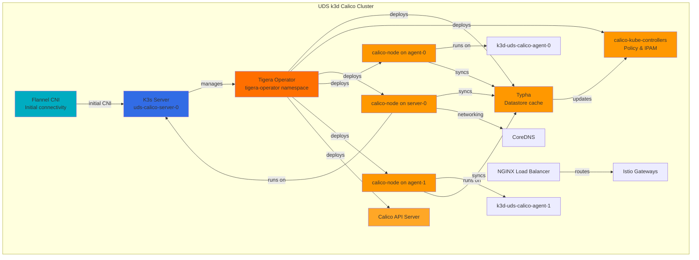
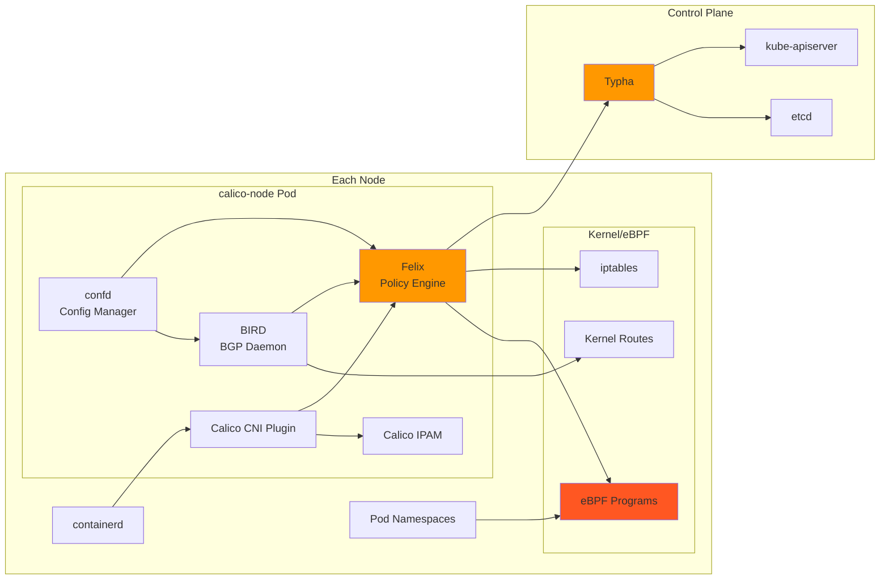
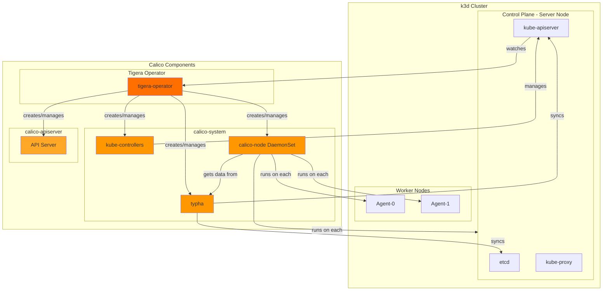

# UDS k3d Calico Zarf Package

> [!IMPORTANT]
> This package should only be used for development and testing purposes. It is not intended for production use and all data is overwritten when the package is re-deployed.

This zarf package serves as a universal dev (local & remote) and test environment for testing [UDS Core](https://github.com/defenseunicorns/uds-core), individual UDS Capabilities, and UDS capabilities aggregated via the [UDS CLI](https://github.com/defenseunicorns/uds-cli).

- [UDS k3d Calico Zarf Package](#uds-k3d-calico-zarf-package)
  - [Overview](#overview)
  - [Prerequisites](#prerequisites)
    - [System Requirements](#system-requirements)
  - [Architecture](#architecture)
    - [k3d Cluster with Calico](#k3d-cluster-with-calico)
    - [Calico Component Architecture](#calico-component-architecture)
  - [Configuration](#configuration)
    - [Variables](#variables)
    - [Components](#components)
  - [Build and Deploy](#build-and-deploy)
    - [Deploy](#deploy)
    - [Deploy with Custom Settings](#deploy-with-custom-settings)
    - [Docker Hub Authentication (Optional)](#docker-hub-authentication-optional)
    - [Airgap Deployment](#airgap-deployment)
    - [Calico Architecture Overview](#calico-architecture-overview)
      - [Core Components](#core-components)
      - [Dataplane Architecture](#dataplane-architecture)
    - [Calico CNI Configuration](#calico-cni-configuration)
    - [CNI Configuration](#cni-configuration)
    - [eBPF Dataplane](#ebpf-dataplane)
    - [DNS Configuration](#dns-configuration)
  - [Cluster Management](#cluster-management)
    - [Stop and Start](#stop-and-start)
    - [Remove](#remove)
    - [Remote Access](#remote-access)
  - [Verification](#verification)
    - [Check Calico Installation](#check-calico-installation)
    - [Run Validation Tests](#run-validation-tests)
  - [Troubleshooting](#troubleshooting)
    - [Calico Issues](#calico-issues)
    - [Network Connectivity](#network-connectivity)
  - [Advanced Configuration](#advanced-configuration)
    - [Custom k3d Arguments](#custom-k3d-arguments)
    - [Network Policies](#network-policies)
  - [Additional Documentation](#additional-documentation)
  - [Notes](#notes)
  - [Resources](#resources)

## Overview

The UDS k3d Calico package creates a k3d cluster with the following features:

- **k3d cluster** with configurable nodes (default: 1 server, 2 workers)
- **Calico CNI v1.29.0** with Tigera Operator for advanced networking
- **eBPF dataplane** support for optimal performance (enabled by default)
- **VXLAN cross-subnet** encapsulation for pod-to-pod communication
- **Container IP forwarding** enabled for proper pod connectivity
- **Direct CNI deployment** without Flannel using upstream Calico manifests
- **Integration with UDS Core** including Istio service mesh support
- **DNS resolution** for `*.uds.dev` domains via CoreDNS overrides
- **Configurable network CIDRs** for subnet, pod, and service networks

## Prerequisites

- [UDS CLI](https://uds.defenseunicorns.com/reference/cli/quickstart-and-usage/#install): version 0.20.0 or later
- [k3d](https://k3d.io/#installation): version 5.7.1 or later
- [Docker](https://docs.docker.com/get-docker/) or [Podman](https://podman.io/getting-started/installation) for running k3d

### System Requirements

- **Memory**: 16GB RAM recommended
- **CPU**: 4+ cores recommended
- **Disk**: 50GB+ available space
- **Kernel**: Linux kernel 5.3+ (for eBPF dataplane)

## Architecture

### k3d Cluster with Calico



### Calico Component Architecture



## Configuration

### Variables

The following variables can be configured when deploying the UDS k3d Calico package:

| Name | Description | Type | Default | Required |
|------|-------------|------|---------|:--------:|
| `CLUSTER_NAME` | Name of the cluster | `string` | `"uds-calico"` | no |
| `SUBNET_CIDR` | Subnet CIDR for the cluster | `string` | `"10.0.0.0/16"` | no |
| `POD_CIDR` | Pod CIDR for the cluster | `string` | `"10.1.0.0/16"` | no |
| `SERVICE_CIDR` | Service CIDR for the cluster | `string` | `"10.96.0.0/12"` | no |
| `K3D_IMAGE` | k3d image to use | `string` | `"rancher/k3s:v1.32.5-k3s1"` | no |
| `K3D_EXTRA_ARGS` | Optionally pass k3d arguments to the default | `string` | `""` | no |
| `NGINX_EXTRA_PORTS` | Optionally allow more ports through Nginx (combine with K3D_EXTRA_ARGS '-p &lt;port&gt;:&lt;port&gt;@server:*') | `string` | `"[]"` | no |
| `DOMAIN` | Cluster domain | `string` | `"uds.dev"` | no |
| `ADMIN_DOMAIN` | Domain for admin services, defaults to `admin.DOMAIN` | `string` | `""` | no |
| `NUMBER_OF_SERVERS` | Number of server nodes | `string` | `"1"` | no |
| `NUMBER_OF_AGENTS` | Number of worker nodes | `string` | `"2"` | no |
| `EXTRA_TLS_SANS` | Additional TLS SANs for the cluster (comma-separated) | `string` | `"127.0.0.1"` | no |
| `REGISTRY_USERNAME` | Username for Docker Hub registry authentication | `string` | `""` | no |
| `REGISTRY_PASSWORD` | Password for Docker Hub registry authentication | `string` | `""` | no |

### Components

The following components are available in the UDS k3d Calico package:

| Name | Description | Required |
|------|-------------|:--------:|
| `destroy-cluster` | Optionally destroy the cluster before creating it | yes |
| `k3d-airgap-images` | Load the airgap images for k3d into Docker | yes¹ |
| `create-cluster-airgap` | Required component for airgap deployments | yes¹ |
| `create-cluster` | Create the k3d cluster | yes |
| `install-calico` | Install Calico CNI v3.30.2 using Helm | yes |
| `verify-calico-connectivity` | Verify Calico BPF configuration and connectivity | yes |
| `connectivity-test` | Test pod-to-pod connectivity across nodes | no |
| `calico-airgap-images` | Load the airgap images for Calico into Docker | yes¹ |

¹ Only required when using the `airgap` flavor

## Build and Deploy

```bash
# Build the package
uds run build

# Deploy the locally built package
uds run deploy

# Run validation tests
uds run validate

# List existing k3d clusters
uds run destroy

# Destroy a specific cluster
uds run destroy --set CLUSTER_NAME=uds-calico
```

### Deploy

<!-- x-release-please-start-version -->

`uds zarf package deploy oci://defenseunicorns/uds-k3d:0.14.2-calico`

<!-- x-release-please-end -->

### Deploy with Custom Settings

```bash
# Deploy with custom K3s version
uds zarf package deploy oci://defenseunicorns/uds-k3d:0.14.2 \
  --set K3D_IMAGE=rancher/k3s:v1.32.5-k3s1

# Deploy with additional ports
uds zarf package deploy oci://defenseunicorns/uds-k3d:0.14.2 \
  --set K3D_EXTRA_ARGS="-p 8080:8080@server:*" \
  --set NGINX_EXTRA_PORTS="[8080]"

# Deploy with custom cluster sizing
uds zarf package deploy oci://defenseunicorns/uds-k3d:0.14.2 \
  --set NUMBER_OF_SERVERS=3 \
  --set NUMBER_OF_WORKERS=4

# Deploy with custom network CIDRs
uds zarf package deploy oci://defenseunicorns/uds-k3d:0.14.2 \
  --set SUBNET_CIDR="10.10.0.0/16" \
  --set POD_CIDR="10.44.0.0/16" \
  --set SERVICE_CIDR="10.97.0.0/16"

# Deploy with additional TLS SANs for external access
uds zarf package deploy oci://defenseunicorns/uds-k3d:0.14.2 \
  --set EXTRA_TLS_SANS="192.168.1.100,my-k3s.example.com"

# Deploy with Docker Hub authentication (optional)
uds zarf package deploy oci://defenseunicorns/uds-k3d:0.14.2 \
  --set DOCKER_HUB_USERNAME="myusername" \
  --set DOCKER_HUB_PASSWORD="mypassword"
```

### Docker Hub Authentication (Optional)

If you're experiencing Docker Hub rate limits, you can optionally provide authentication credentials:

1. **Interactive prompt**: The package will prompt for credentials during deployment
2. **Command line**: Pass credentials as shown above
3. **Environment variables**: Set `ZARF_VAR_DOCKER_HUB_USERNAME` and `ZARF_VAR_DOCKER_HUB_PASSWORD`

**Note**: Docker Hub authentication is completely optional. If no credentials are provided:

- The `registries.yaml` file will not be created
- The `--registry-config` flag will not be passed to k3d
- The cluster will work normally but may be subject to Docker Hub's anonymous rate limits

When credentials are provided, they configure k3d's registry authentication, allowing all nodes in the cluster to pull images from Docker Hub with your account's rate limits.

### Airgap Deployment

For environments without internet access, use the airgap flavor:

```bash
# Build the airgap package
uds run build-airgap-package

# Deploy the airgap package
uds run deploy-airgap-package
```

The airgap flavor includes all required images:

- k3d/K3s base images
- Calico CNI images (Tigera Operator, Calico components)

See [Airgap Documentation](docs/AIRGAP.md) for more details.

### Calico Architecture Overview

Based on the [official Calico architecture](https://docs.tigera.io/calico/latest/reference/architecture/overview), here's how Calico integrates with our k3d cluster:



Calico consists of several key components that work together to provide networking and security:

#### Core Components

1. **Tigera Operator**: Manages the lifecycle of all Calico components
   - Deploys and configures Calico based on the Installation CR
   - Monitors component health via TigeraStatus CRs
   - Handles upgrades and configuration changes

2. **Felix** (calico-node): The policy engine on each node
   - Programs eBPF maps or iptables rules
   - Handles network policy enforcement
   - Manages pod connectivity and load balancing

3. **BIRD** (calico-node): BGP daemon for route distribution
   - Distributes pod routes between nodes
   - Enables pod-to-pod communication across nodes
   - Not used in VXLAN mode but included for compatibility

4. **Typha**: Datastore cache and fan-out service
   - Reduces load on Kubernetes API server
   - Caches Calico resources for calico-node instances
   - Essential for clusters with many nodes

5. **calico-kube-controllers**: Cluster-wide controllers
   - Manages IP address allocation (IPAM)
   - Handles node lifecycle events
   - Synchronizes Kubernetes and Calico resources

6. **Calico API Server**: Extended Kubernetes API
   - Provides Calico-specific API resources
   - Enables kubectl access to Calico resources
   - Integrates with Kubernetes RBAC

#### Dataplane Architecture

In this deployment, Calico uses the **eBPF dataplane** with the following configuration:

- **BPF Programs**: Replace iptables for packet processing
- **Tunnel Mode**: Used for service traffic (compatible with kube-proxy)
- **VXLAN Encapsulation**: For pod-to-pod traffic across subnets
- **Flannel Coexistence**: Maintains Zarf deployment requirements

### Calico CNI Configuration

The UDS k3d Calico package configures Calico with:

- **IP Pool**: Uses the configured Pod CIDR (default: `10.1.0.0/16`)
- **Block Size**: `/26` (64 IPs per Node)
- **Encapsulation**: `VXLANCrossSubnet`
- **NAT Outgoing**: Enabled
- **Container IP Forwarding**: Enabled
- **Dataplane**: eBPF with DSR mode and `bpfConnectTimeLoadBalancing` disabled for Istio Ambient compatibility

### CNI Configuration

The package deploys Calico CNI using the following approach:

1. K3s cluster starts with Flannel CNI (default K3s behavior)
2. CoreDNS becomes available with basic networking via Flannel
3. Calico is installed using the official Helm chart (v3.30.2)
4. Flannel continues to run alongside Calico (required for Zarf connectivity)
5. Calico BPF dataplane is configured to work with K3s embedded kube-proxy

**Important Notes**:

- The package uses Calico in BPF "Tunnel" mode to ensure compatibility with K3s's embedded kube-proxy
- Flannel remains active to maintain Zarf's cluster connectivity requirements
- Service traffic is handled by kube-proxy while pod-to-pod traffic uses Calico BPF

### eBPF Dataplane

The eBPF dataplane is enabled by default with:

```yaml
bpfEnabled: true
bpfExternalServiceMode: Tunnel
bpfConnectTimeLoadBalancing: Disabled
bpfKubeProxyIptablesCleanupEnabled: false
```

Key configuration choices:

- **Tunnel mode**: Used instead of DSR to ensure compatibility with K3s embedded kube-proxy
- **No iptables cleanup**: Preserves kube-proxy rules for service handling
- **BPF for pod traffic**: Provides high-performance pod-to-pod networking

This configuration allows Calico BPF and kube-proxy to coexist, with each handling their respective traffic types.

### DNS Configuration

CoreDNS is configured with rewrites for `*.uds.dev` domains:

- `*.admin.uds.dev` → `admin-ingressgateway.istio-admin-gateway.svc.cluster.local`
- `*.uds.dev` → `tenant-ingressgateway.istio-tenant-gateway.svc.cluster.local`
- `*.uds.dev` (fallback) → `host.k3d.internal`

## Cluster Management

### Stop and Start

```bash
# Stop the cluster
k3d cluster stop uds-calico

# Start the cluster
k3d cluster start uds-calico
```

### Remove

```bash
# Delete the cluster
k3d cluster delete uds-calico
```

### Remote Access

If working with a remote cluster over SSH, you can use SSH port-forwarding to connect:

```console
# Non-standard ports
ssh -N -L 8080:localhost:80 -L 8443:localhost:443 -L 6550:localhost:6550 <your-remote-host>

# Standard ports (requires sudo)
sudo ssh -N -L 80:localhost:80 -L 443:localhost:443 -L 6550:localhost:6550 <your-remote-host>
```

## Verification

### Check Calico Installation

```bash
# Check Calico pods
kubectl get pods -n tigera-operator
kubectl get pods -n calico-system
kubectl get pods -n calico-apiserver

# Verify Calico installation status
kubectl get tigerastatus

# Check eBPF dataplane is enabled
kubectl get installation default -o jsonpath='{.spec.calicoNetwork.linuxDataplane}'
```

### Run Validation Tests

```bash
# Run validation tests
uds run validate

# This validates:
# - CoreDNS *.uds.dev resolution
# - Zarf init compatibility

# Run connectivity test (optional component)
uds zarf package deploy oci://defenseunicorns/uds-k3d:0.14.2 \
  --components connectivity-test

# Or when deploying locally built package
uds zarf package deploy zarf-package-uds-k3d-*.tar.zst \
  --components connectivity-test
```

## Troubleshooting

### Calico Issues

```bash
# Check Tigera operator logs
kubectl logs -n tigera-operator deployment/tigera-operator

# Check Calico node logs
kubectl logs -n calico-system -l k8s-app=calico-node

# Verify eBPF status
kubectl get felixconfiguration default -o yaml
```

### Network Connectivity

```bash
# Test pod-to-pod connectivity
kubectl run test-pod --image=busybox --rm -it -- \
  ping <pod-ip-on-different-node>

# Check Calico endpoints
kubectl get workloadendpoints -A

# Run the built-in connectivity test
# This deploys nginx and busybox pods with anti-affinity rules
# to ensure they run on different nodes, then verifies HTTP connectivity
uds zarf package deploy zarf-package-uds-k3d-*.tar.zst \
  --components connectivity-test
```

## Advanced Configuration

### Custom k3d Arguments

You can set extra k3d args by setting the deploy-time ZARF_VAR_K3D_EXTRA_ARGS:

```yaml
package:
  deploy:
    set:
      k3d_extra_args: "--k3s-arg --gpus=all --k3s-arg --<arg2>=<value>"
```

### Network Policies

Calico supports both Kubernetes `NetworkPolicies` and enhanced Calico policies:

```yaml
apiVersion: projectcalico.org/v3
kind: NetworkPolicy
metadata:
  name: allow-ingress
  namespace: default
spec:
  selector: app == "web"
  types:
  - Ingress
  ingress:
  - action: Allow
    source:
      selector: app == "frontend"
    destination:
      ports:
      - 80
```

## Additional Documentation

- [Configure MinIO](docs/MINIO.md)
- [DNS Assumptions](docs/DNS.md)
- [Airgap Deployment](docs/AIRGAP.md)

## Notes

> [!NOTE]
> UDS k3d intentionally does not address airgap concerns for k3d or the load balancer logic deployed in this package. This allows running `zarf init` or deploying a Zarf Init Package via a UDS Bundle after the UDS k3d environment is deployed.

## Resources

- [UDS Core Documentation](https://github.com/defenseunicorns/uds-core)
- [Calico Documentation](https://docs.tigera.io/calico/latest/)
- [Calico eBPF Dataplane](https://docs.tigera.io/calico/latest/operations/ebpf/)
- [k3d Documentation](https://k3d.io/)
- [UDS CLI Documentation](https://uds.defenseunicorns.com/)
