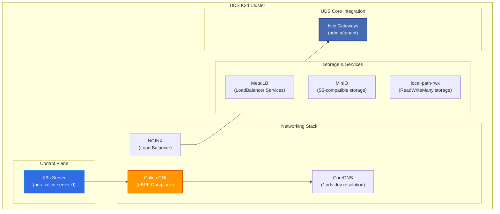

# UDS K3d Calico Environment

> [!IMPORTANT]
> This package should only be used for development and testing purposes. It is not intended for production use and all data is overwritten when the package is re-deployed.

This zarf package serves as a universal dev (local & remote) and test environment for testing [UDS Core](https://github.com/defenseunicorns/uds-core), individual UDS Capabilities, and UDS capabilities aggregated via the [UDS CLI](https://github.com/defenseunicorns/uds-cli).

## Overview

The UDS K3d package creates a k3d cluster with the following features:

- **K3d cluster** with 1 server node and 2 agent nodes by default
- **Calico CNI v1.29.0** with Tigera Operator for advanced networking
- **eBPF dataplane** support for optimal performance (enabled by default)
- **VXLAN cross-subnet** encapsulation for pod-to-pod communication
- **Container IP forwarding** enabled for proper pod connectivity
- **Seamless CNI migration** from Flannel to Calico during deployment
- **Integration with UDS Core** including Istio service mesh support
- **DNS resolution** for `*.uds.dev` domains via CoreDNS overrides
- **UDS Dev Stack**: MetalLB, NGINX, MinIO, and local-path-rwx storage

## Prerequisites

- [UDS CLI](https://uds.defenseunicorns.com/reference/cli/quickstart-and-usage/#install): version 0.20.0 or later
- [K3d](https://k3d.io/#installation): version 5.7.1 or later
- [Docker](https://docs.docker.com/get-docker/) or [Podman](https://podman.io/getting-started/installation) for running K3d

### System Requirements

- **Memory**: 16GB RAM recommended
- **CPU**: 4+ cores recommended
- **Disk**: 50GB+ available space
- **Kernel**: Linux kernel 5.3+ (for eBPF dataplane)

## Deploy

<!-- x-release-please-start-version -->

`uds zarf package deploy oci://defenseunicorns/uds-k3d:0.14.2`

<!-- x-release-please-end -->

### Deploy with Custom Settings

```bash
# Deploy with custom K3s version
uds zarf package deploy oci://defenseunicorns/uds-k3d:0.14.2 \
  --set K3D_IMAGE=rancher/k3s:v1.32.5-k3s1

# Deploy with additional ports
uds zarf package deploy oci://defenseunicorns/uds-k3d:0.14.2 \
  --set K3D_EXTRA_ARGS="-p 8080:8080@server:*" \
  --set NGINX_EXTRA_PORTS="[8080]"
```

### Build and Deploy Locally

```bash
# Build the package
uds run build

# Deploy the locally built package
uds run deploy

# Run validation tests
uds run validate

# List existing k3d clusters
uds run destroy

# Destroy a specific cluster
uds run destroy --set CLUSTER_NAME=uds-calico
```

## Architecture

### K3d Cluster with Calico



## Configuration

### Calico CNI Configuration

The UDS K3d package configures Calico with:

- **IP Pool**: `10.42.0.0/16` (for Pods)
- **Block Size**: `/26` (64 IPs per Node)
- **Encapsulation**: `VXLANCrossSubnet`
- **NAT Outgoing**: Enabled
- **Container IP Forwarding**: Enabled
- **Dataplane**: eBPF with DSR mode and `bpfConnectTimeLoadBalancing` disabled for Istio Ambient compatibility

### CNI Migration Process

The package implements a seamless CNI migration strategy:

1. K3s cluster starts with Flannel CNI (default)
2. CoreDNS becomes available with basic networking
3. Calico CNI is installed via Tigera Operator
4. Flannel is removed after Calico is ready
5. eBPF dataplane is enabled for optimal performance

This approach ensures continuous cluster connectivity throughout the deployment.

### eBPF Dataplane

The eBPF dataplane is enabled by default with:

```yaml
bpfEnabled: true
bpfExternalServiceMode: DSR
bpfConnectTimeLoadBalancing: Disabled
```

This provides high-performance packet processing and better compatibility with Istio Ambient mesh.

### DNS Configuration

CoreDNS is configured with rewrites for `*.uds.dev` domains:

- `*.admin.uds.dev` → `admin-ingressgateway.istio-admin-gateway.svc.cluster.local`
- `*.uds.dev` → `tenant-ingressgateway.istio-tenant-gateway.svc.cluster.local`
- `*.uds.dev` (fallback) → `host.k3d.internal`

## Cluster Management

### Stop and Start

```bash
# Stop the cluster
k3d cluster stop uds-calico

# Start the cluster
k3d cluster start uds-calico
```

### Remove

```bash
# Delete the cluster
k3d cluster delete uds-calico
```

### Remote Access

If working with a remote cluster over SSH, you can use SSH port-forwarding to connect:

```console
# Non-standard ports
ssh -N -L 8080:localhost:80 -L 8443:localhost:443 -L 6550:localhost:6550 <your-remote-host>

# Standard ports (requires sudo)
sudo ssh -N -L 80:localhost:80 -L 443:localhost:443 -L 6550:localhost:6550 <your-remote-host>
```

## Verification

### Check Calico Installation

```bash
# Check Calico pods
kubectl get pods -n tigera-operator
kubectl get pods -n calico-system
kubectl get pods -n calico-apiserver

# Verify Calico installation status
kubectl get tigerastatus

# Check eBPF dataplane is enabled
kubectl get installation default -o jsonpath='{.spec.calicoNetwork.linuxDataplane}'
```

### Run Validation Tests

```bash
# Run validation tests
uds run validate

# This validates:
# - CoreDNS *.uds.dev resolution
# - Zarf init compatibility

# Run connectivity test (optional component)
uds zarf package deploy oci://defenseunicorns/uds-k3d:0.14.2 \
  --components connectivity-test

# Or when deploying locally built package
uds zarf package deploy zarf-package-uds-k3d-*.tar.zst \
  --components connectivity-test
```

## Troubleshooting

### Calico Issues

```bash
# Check Tigera operator logs
kubectl logs -n tigera-operator deployment/tigera-operator

# Check Calico node logs
kubectl logs -n calico-system -l k8s-app=calico-node

# Verify eBPF status
kubectl get felixconfiguration default -o yaml
```

### Network Connectivity

```bash
# Test pod-to-pod connectivity
kubectl run test-pod --image=busybox --rm -it -- \
  ping <pod-ip-on-different-node>

# Check Calico endpoints
kubectl get workloadendpoints -A

# Run the built-in connectivity test
# This deploys nginx and busybox pods with anti-affinity rules
# to ensure they run on different nodes, then verifies HTTP connectivity
uds zarf package deploy zarf-package-uds-k3d-*.tar.zst \
  --components connectivity-test
```

## Advanced Configuration

### Custom K3d Arguments

You can set extra k3d args by setting the deploy-time ZARF_VAR_K3D_EXTRA_ARGS:

```yaml
package:
  deploy:
    set:
      k3d_extra_args: "--k3s-arg --gpus=all --k3s-arg --<arg2>=<value>"
```

### Network Policies

Calico supports both Kubernetes `NetworkPolicies` and enhanced Calico policies:

```yaml
apiVersion: projectcalico.org/v3
kind: NetworkPolicy
metadata:
  name: allow-ingress
  namespace: default
spec:
  selector: app == "web"
  types:
  - Ingress
  ingress:
  - action: Allow
    source:
      selector: app == "frontend"
    destination:
      ports:
      - 80
```

## Additional Documentation

- [Configure MinIO](docs/MINIO.md)
- [DNS Assumptions](docs/DNS.md)
- [Airgap Deployment](docs/AIRGAP.md)

## Notes

> [!NOTE]
> UDS K3d intentionally does not address airgap concerns for K3d or the load balancer logic deployed in this package. This allows running `zarf init` or deploying a Zarf Init Package via a UDS Bundle after the UDS K3d environment is deployed.

## Resources

- [UDS Core Documentation](https://github.com/defenseunicorns/uds-core)
- [Calico Documentation](https://docs.tigera.io/calico/latest/)
- [Calico eBPF Dataplane](https://docs.tigera.io/calico/latest/operations/ebpf/)
- [K3d Documentation](https://k3d.io/)
- [UDS CLI Documentation](https://uds.defenseunicorns.com/)
