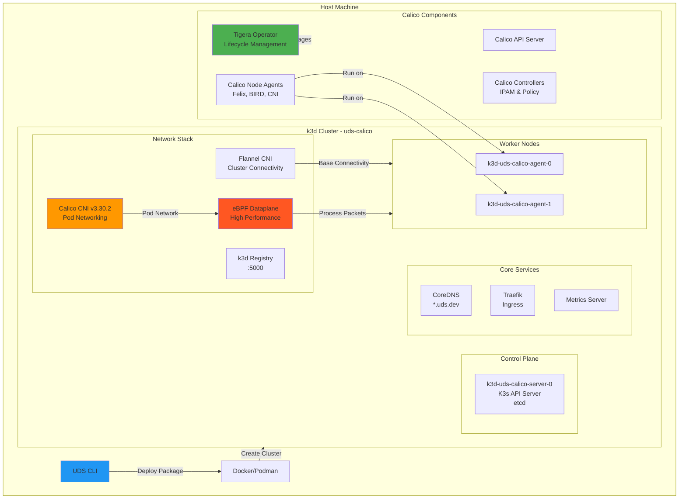

# UDS k3d Calico Zarf Package

> [!IMPORTANT]
> This package should only be used for development and testing purposes. It is not intended for production use and all data is overwritten when the package is re-deployed.

This zarf package serves as a universal dev (local & remote) and test environment for testing [UDS Core](https://github.com/defenseunicorns/uds-core), individual UDS Capabilities, and UDS capabilities aggregated via the [UDS CLI](https://github.com/defenseunicorns/uds-cli).

- [UDS k3d Calico Zarf Package](#uds-k3d-calico-zarf-package)
  - [Overview](#overview)
  - [Prerequisites](#prerequisites)
    - [System Requirements](#system-requirements)
  - [Architecture](#architecture)
  - [Configuration](#configuration)
    - [Variables](#variables)
    - [Components](#components)
  - [Build and Deploy](#build-and-deploy)
    - [Deploy](#deploy)
    - [Deploy with Custom Settings](#deploy-with-custom-settings)
    - [Docker Hub Authentication (Optional)](#docker-hub-authentication-optional)
    - [Airgap Deployment](#airgap-deployment)
    - [DNS Configuration](#dns-configuration)
  - [Cluster Management](#cluster-management)
    - [Stop and Start](#stop-and-start)
    - [Remove](#remove)
    - [Remote Access](#remote-access)
  - [Verification](#verification)
    - [Check Calico Installation](#check-calico-installation)
    - [Run Validation Tests](#run-validation-tests)
  - [Troubleshooting](#troubleshooting)
    - [Network Connectivity](#network-connectivity)
  - [Advanced Configuration](#advanced-configuration)
    - [Custom k3d Arguments](#custom-k3d-arguments)
  - [Additional Documentation](#additional-documentation)
  - [Notes](#notes)
  - [Resources](#resources)

## Overview

The UDS k3d Calico package creates a k3d cluster with the following features:

- **k3d cluster** with configurable nodes (default: 1 server, 2 workers)
- **Calico CNI v3.30.2** with Tigera Operator for advanced networking
- **eBPF dataplane** support for optimal performance (enabled by default)
- **VXLAN cross-subnet** encapsulation for pod-to-pod communication
- **Container IP forwarding** enabled for proper pod connectivity
- **Helm-based deployment** using official Tigera Operator chart v3.30.2
- **Integration with UDS Core** including Istio service mesh support
- **DNS resolution** for `*.uds.dev` domains via CoreDNS overrides
- **Configurable network CIDRs** for subnet, pod, and service networks

## Prerequisites

- [UDS CLI](https://uds.defenseunicorns.com/reference/cli/quickstart-and-usage/#install): version 0.20.0 or later
- [k3d](https://k3d.io/#installation): version 5.7.1 or later
- [Docker](https://docs.docker.com/get-docker/) or [Podman](https://podman.io/getting-started/installation) for running k3d

### System Requirements

- **Memory**: 16GB RAM recommended
- **CPU**: 4+ cores recommended
- **Disk**: 50GB+ available space
- **Kernel**: Linux kernel 5.3+ (for eBPF dataplane)

## Architecture



For detailed architecture diagrams and component descriptions, see:
- [Calico CNI Documentation](docs/CALICO.md) - Complete Calico architecture and component details
- [eBPF Dataplane Documentation](docs/EBPF.md) - eBPF dataplane architecture and traffic flow

## Configuration

### Variables

The following variables can be configured when deploying the UDS k3d Calico package:

| Name | Description | Type | Default | Required |
|------|-------------|------|---------|:--------:|
| `CLUSTER_NAME` | Name of the cluster | `string` | `"uds-calico"` | no |
| `SUBNET_CIDR` | Subnet CIDR for the cluster | `string` | `"10.0.0.0/16"` | no |
| `POD_CIDR` | Pod CIDR for the cluster | `string` | `"10.1.0.0/16"` | no |
| `SERVICE_CIDR` | Service CIDR for the cluster | `string` | `"10.96.0.0/12"` | no |
| `K3D_IMAGE` | k3d image to use | `string` | `"rancher/k3s:v1.32.5-k3s1"` | no |
| `K3D_EXTRA_ARGS` | Optionally pass k3d arguments to the default | `string` | `""` | no |
| `NGINX_EXTRA_PORTS` | Optionally allow more ports through Nginx (combine with K3D_EXTRA_ARGS '-p &lt;port&gt;:&lt;port&gt;@server:*') | `string` | `"[]"` | no |
| `DOMAIN` | Cluster domain | `string` | `"uds.dev"` | no |
| `ADMIN_DOMAIN` | Domain for admin services, defaults to `admin.DOMAIN` | `string` | `""` | no |
| `NUMBER_OF_SERVERS` | Number of server nodes | `string` | `"1"` | no |
| `NUMBER_OF_AGENTS` | Number of worker nodes | `string` | `"2"` | no |
| `EXTRA_TLS_SANS` | Additional TLS SANs for the cluster (comma-separated) | `string` | `"127.0.0.1"` | no |
| `DOCKER_HUB_USERNAME` | Username for Docker Hub authentication | `string` | `""` | no |
| `DOCKER_HUB_PASSWORD` | Password for Docker Hub authentication | `string` | `""` | no |

### Components

The following components are available in the UDS k3d Calico package:

| Name | Description | Required |
|------|-------------|:--------:|
| `destroy-cluster` | Optionally destroy the cluster before creating it | yes |
| `k3d-airgap-images` | Load the airgap images for k3d into Docker | yes¹ |
| `create-cluster-airgap` | Required component for airgap deployments | yes¹ |
| `create-cluster` | Create the k3d cluster | yes |
| `install-calico` | Install Calico CNI v3.30.2 using Helm | yes |
| `verify-calico-connectivity` | Verify Calico BPF configuration and connectivity | yes |
| `connectivity-test` | Test pod-to-pod connectivity across nodes | no |
| `calico-airgap-images` | Load the airgap images for Calico into Docker | yes¹ |

¹ Only required when using the `airgap` flavor

## Build and Deploy

```bash
# Build the package
uds run build

# Deploy the locally built package
uds run deploy

# Run validation tests
uds run validate

# List existing k3d clusters
uds run destroy

# Destroy a specific cluster
uds run destroy --set CLUSTER_NAME=uds-calico
```

### Deploy

<!-- x-release-please-start-version -->

`uds zarf package deploy oci://defenseunicorns/0.14.3-calico`

<!-- x-release-please-end -->

### Deploy with Custom Settings

```bash
# Deploy with custom K3s version
uds zarf package deploy oci://defenseunicorns/0.14.3-calico \
  --set K3D_IMAGE=rancher/k3s:v1.32.5-k3s1

# Deploy with additional ports
uds zarf package deploy oci://defenseunicorns/0.14.3-calico \
  --set K3D_EXTRA_ARGS="-p 8080:8080@server:*" \
  --set NGINX_EXTRA_PORTS="[8080]"

# Deploy with custom cluster sizing
uds zarf package deploy oci://defenseunicorns/0.14.3-calico \
  --set NUMBER_OF_SERVERS=3 \
  --set NUMBER_OF_WORKERS=4

# Deploy with custom network CIDRs
uds zarf package deploy oci://defenseunicorns/0.14.3-calico \
  --set SUBNET_CIDR="10.10.0.0/16" \
  --set POD_CIDR="10.44.0.0/16" \
  --set SERVICE_CIDR="10.97.0.0/16"

# Deploy with additional TLS SANs for external access
uds zarf package deploy oci://defenseunicorns/0.14.3-calico \
  --set EXTRA_TLS_SANS="192.168.1.100,my-k3s.example.com"

# Deploy with Docker Hub authentication (optional)
uds zarf package deploy oci://defenseunicorns/0.14.3-calico \
  --set DOCKER_HUB_USERNAME="myusername" \
  --set DOCKER_HUB_PASSWORD="mypassword"
```

### Docker Hub Authentication (Optional)

If you're experiencing Docker Hub rate limits, you can optionally provide authentication credentials:

1. **Interactive prompt**: The package will prompt for credentials during deployment
2. **Command line**: Pass credentials as shown above
3. **Environment variables**: Set `ZARF_VAR_DOCKER_HUB_USERNAME` and `ZARF_VAR_DOCKER_HUB_PASSWORD`

**Note**: Docker Hub authentication is completely optional. If no credentials are provided:

- The `registries.yaml` file will not be created
- The `--registry-config` flag will not be passed to k3d
- The cluster will work normally but may be subject to Docker Hub's anonymous rate limits

When credentials are provided, they configure k3d's registry authentication, allowing all nodes in the cluster to pull images from Docker Hub with your account's rate limits.

### Airgap Deployment

For environments without internet access, use the airgap flavor:

```bash
# Build the airgap package
uds run build-airgap-package

# Deploy the airgap package
uds run deploy-airgap-package
```

The airgap flavor includes all required images:

- k3d/K3s base images
- Calico CNI images (Tigera Operator, Calico components)

See [Airgap Documentation](docs/AIRGAP.md) for more details.

### DNS Configuration

CoreDNS is configured with rewrites for `*.uds.dev` domains:

- `*.admin.uds.dev` → `admin-ingressgateway.istio-admin-gateway.svc.cluster.local`
- `*.uds.dev` → `tenant-ingressgateway.istio-tenant-gateway.svc.cluster.local`
- `*.uds.dev` (fallback) → `host.k3d.internal`

## Cluster Management

### Stop and Start

```bash
# Stop the cluster
k3d cluster stop uds-calico

# Start the cluster
k3d cluster start uds-calico
```

### Remove

```bash
# Delete the cluster
k3d cluster delete uds-calico
```

### Remote Access

If working with a remote cluster over SSH, you can use SSH port-forwarding to connect:

```console
# Non-standard ports
ssh -N -L 8080:localhost:80 -L 8443:localhost:443 -L 6550:localhost:6550 <your-remote-host>

# Standard ports (requires sudo)
sudo ssh -N -L 80:localhost:80 -L 443:localhost:443 -L 6550:localhost:6550 <your-remote-host>
```

## Verification

### Check Calico Installation

For detailed Calico verification steps, see [Calico CNI Documentation](docs/CALICO.md#verification).

### Run Validation Tests

```bash
# Run validation tests
uds run validate

# This validates:
# - CoreDNS *.uds.dev resolution
# - Zarf init compatibility

# Run connectivity test (optional component)
uds zarf package deploy oci://defenseunicorns/uds-k3d:0.1.0 \
  --components connectivity-test

# Or when deploying locally built package
uds zarf package deploy zarf-package-uds-k3d-*.tar.zst \
  --components connectivity-test
```

## Troubleshooting

### Network Connectivity

```bash
# Test pod-to-pod connectivity
kubectl run test-pod --image=busybox --rm -it -- \
  ping <pod-ip-on-different-node>

# Check Calico endpoints
kubectl get workloadendpoints -A

# Run the built-in connectivity test
# This deploys nginx and busybox pods with anti-affinity rules
# to ensure they run on different nodes, then verifies HTTP connectivity
uds zarf package deploy zarf-package-uds-k3d-*.tar.zst \
  --components connectivity-test
```

## Advanced Configuration

### Custom k3d Arguments

You can set extra k3d args by setting the deploy-time ZARF_VAR_K3D_EXTRA_ARGS:

```yaml
package:
  deploy:
    set:
      k3d_extra_args: "--k3s-arg --gpus=all --k3s-arg --<arg2>=<value>"
```

## Additional Documentation

- [Calico CNI Documentation](docs/CALICO.md) - Architecture, components, and configuration details
- [eBPF Dataplane Documentation](docs/EBPF.md) - Performance benefits and troubleshooting
- [DNS Assumptions](docs/DNS.md)
- [Airgap Deployment](docs/AIRGAP.md)

## Notes

> [!NOTE]
> UDS k3d intentionally does not address airgap concerns for k3d or the load balancer logic deployed in this package. This allows running `zarf init` or deploying a Zarf Init Package via a UDS Bundle after the UDS k3d environment is deployed.

## Resources

- [UDS Core Documentation](https://github.com/defenseunicorns/uds-core)
- [Calico Documentation](https://docs.tigera.io/calico/latest/)
- [Calico eBPF Dataplane](https://docs.tigera.io/calico/latest/operations/ebpf/)
- [k3d Documentation](https://k3d.io/)
- [UDS CLI Documentation](https://uds.defenseunicorns.com/)
