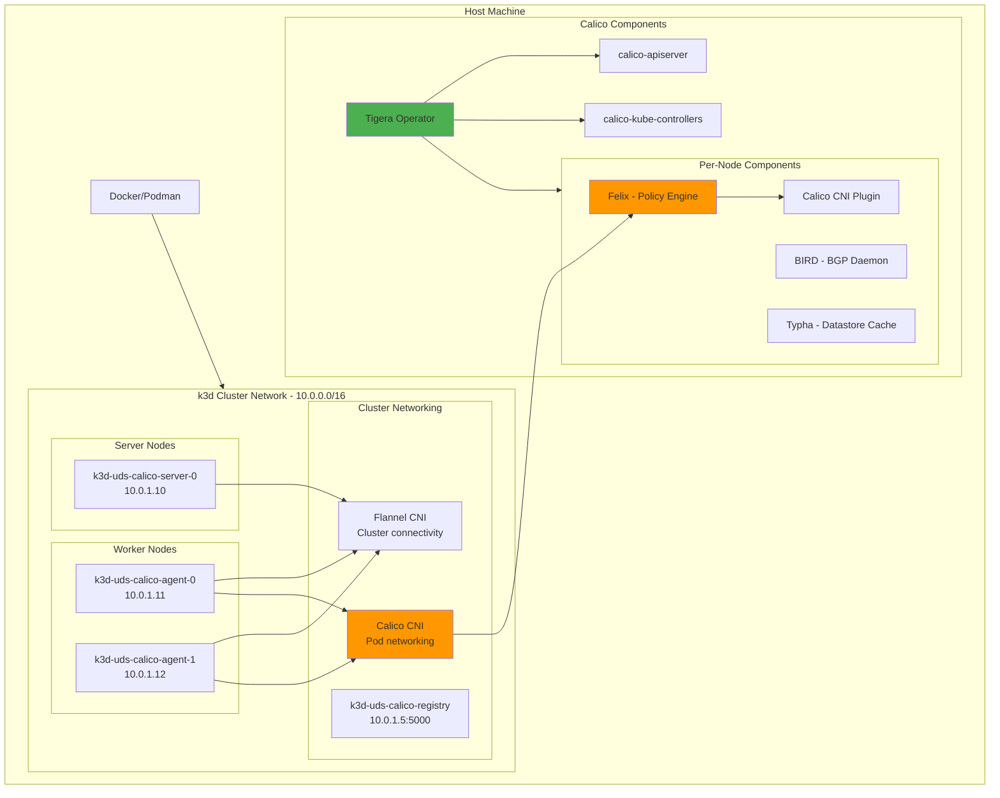
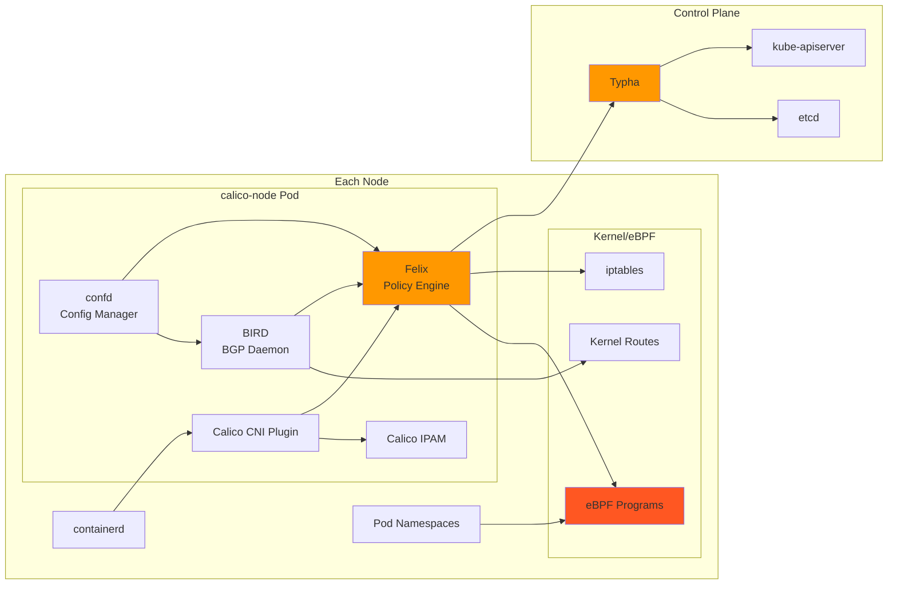
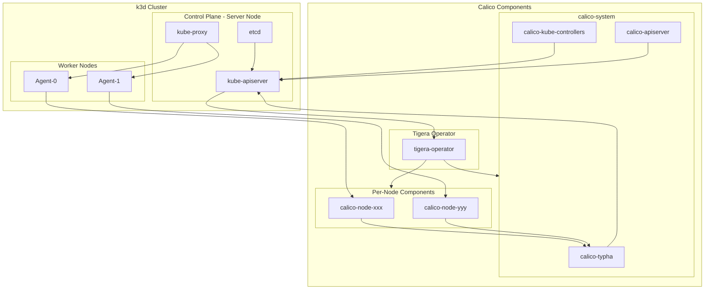

# Calico CNI Documentation

This document provides detailed information about the Calico CNI integration in the UDS k3d package.

## Overview

The UDS k3d Calico package deploys Calico CNI v3.30.2 using the official Tigera Operator Helm chart. Calico provides advanced networking capabilities including eBPF dataplane support, network policies, and flexible IPAM.

## Architecture

### k3d Cluster with Calico



### Calico Component Architecture



## Core Components

Based on the [official Calico architecture](https://docs.tigera.io/calico/latest/reference/architecture/overview), here's how Calico integrates with our k3d cluster:



### Component Descriptions

#### Tigera Operator
- **Purpose**: Manages the lifecycle of all Calico components
- **Namespace**: `tigera-operator`
- **Key Responsibilities**:
  - Installs and upgrades Calico components
  - Configures RBAC and security policies
  - Manages CRDs for Calico resources

#### calico-node (Felix)
- **Purpose**: Primary Calico agent running on each node
- **Key Components**:
  - **Felix**: Programs routes and eBPF/iptables rules
  - **BIRD**: BGP client for route distribution (if BGP is enabled)
  - **confd**: Monitors Calico datastore for config changes
- **Responsibilities**:
  - Enforces network policies
  - Programs eBPF maps for packet processing
  - Manages IP allocation for pods

#### calico-kube-controllers
- **Purpose**: Monitors Kubernetes API and performs cluster-wide functions
- **Responsibilities**:
  - Garbage collection of Calico resources
  - Synchronizes node labels to Calico datastore
  - Manages IP pool allocation

#### Typha
- **Purpose**: Datastore cache to reduce load on Kubernetes API
- **Benefits**:
  - Scales Calico to large clusters
  - Reduces API server load
  - Provides fan-out for configuration updates

#### calico-apiserver
- **Purpose**: Provides API for Calico-specific resources
- **Features**:
  - REST API for Calico policies
  - Integration with kubectl for calicoctl functionality
  - RBAC-controlled access to Calico resources

### Dataplane Architecture

In this deployment, Calico uses the **eBPF dataplane** with the following configuration:

- **BPF Programs**: Replace iptables for packet processing
- **Tunnel Mode**: Ensures compatibility with K3s kube-proxy
- **Service Traffic**: Handled by kube-proxy (not Calico eBPF)
- **Pod Traffic**: Processed by Calico eBPF for high performance

## CNI Configuration

The package deploys Calico CNI using the following approach:

1. K3s cluster starts with Flannel CNI (default K3s behavior)
2. CoreDNS becomes available with basic networking via Flannel
3. Calico is installed using the official Helm chart (v3.30.2)
4. Flannel continues to run alongside Calico (required for Zarf connectivity)
5. Calico BPF dataplane is configured to work with K3s embedded kube-proxy

**Important Notes**:

- The package uses Calico in BPF "Tunnel" mode to ensure compatibility with K3s's embedded kube-proxy
- Flannel remains active to maintain Zarf's cluster connectivity requirements
- Service traffic is handled by kube-proxy while pod-to-pod traffic uses Calico BPF

## Installation Process

Calico is installed via the `install-calico` component in `zarf.yaml`:

1. **Pre-installation**: Retrieves Kubernetes service endpoint details
2. **Helm Installation**: Deploys tigera-operator chart with custom values
3. **Post-installation**: Verifies Calico components are running

The custom values file (`values/calico-values.yaml`) configures:
- eBPF dataplane settings
- IP pool configuration with POD_CIDR
- VXLAN cross-subnet encapsulation
- Container IP forwarding

## Verification

### Check Calico Installation

```bash
# Check Tigera status
./zarf tools kubectl get tigerastatus

# Check Calico pods
./zarf tools kubectl get pods -n calico-system
./zarf tools kubectl get pods -n calico-apiserver
./zarf tools kubectl get pods -n tigera-operator

# Check Calico nodes
./zarf tools kubectl get nodes -o custom-columns=NAME:.metadata.name,CALICO:.metadata.annotations.'projectcalico\.org/IPv4Address'
```

## Network Policies

Calico provides advanced network policy capabilities beyond standard Kubernetes NetworkPolicies:

### Example: Restrict Traffic Between Namespaces

```yaml
apiVersion: projectcalico.org/v3
kind: GlobalNetworkPolicy
metadata:
  name: isolate-namespaces
spec:
  selector: all()
  types:
  - Ingress
  - Egress
  ingress:
  - action: Allow
    source:
      namespaceSelector: name == "kube-system"
  - action: Allow
    source:
      namespaceSelector: projectcalico.org/name == k8s.Namespace
  egress:
  - action: Allow
    destination:
      namespaceSelector: name == "kube-system"
  - action: Allow
    destination:
      namespaceSelector: projectcalico.org/name == k8s.Namespace
```

## Troubleshooting

### Calico Issues

If Calico pods are not starting:

```bash
# Check operator logs
./zarf tools kubectl logs -n tigera-operator deployment/tigera-operator

# Check node logs
./zarf tools kubectl logs -n calico-system -l k8s-app=calico-node

# Verify IP pools
./zarf tools kubectl get ippools
```

### Common Issues

1. **IP Pool Conflicts**: Ensure POD_CIDR doesn't overlap with host or service networks
2. **eBPF Requirements**: Verify kernel version supports eBPF (5.3+)
3. **Flannel Conflicts**: Both CNIs coexist but serve different purposes
4. **DNS Resolution**: CoreDNS must be configured with proper cluster DNS

## Advanced Configuration

### Custom IP Pools

To modify the IP pool configuration, update the `POD_CIDR` variable when deploying:

```bash
uds run deploy --set POD_CIDR=192.168.0.0/16
```

### BGP Configuration

While not enabled by default, Calico supports BGP for advanced routing scenarios. This requires additional configuration in the values file.

### Network Policy Enforcement

Calico enforces both Kubernetes NetworkPolicies and its own enhanced policies. The eBPF dataplane provides high-performance policy enforcement at the kernel level.