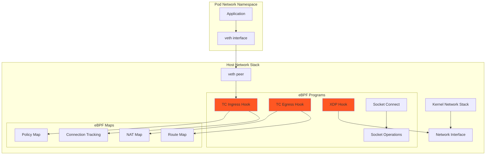

# eBPF Dataplane Documentation

This document provides detailed information about the eBPF dataplane configuration in the UDS k3d Calico package.

## Overview

The eBPF (extended Berkeley Packet Filter) dataplane is Calico's high-performance packet processing engine that runs in the Linux kernel. It replaces iptables rules with eBPF programs for improved performance and lower CPU overhead.

## System Requirements

To use the eBPF dataplane, your system must meet these requirements:

- **Linux kernel 5.3+** (required for eBPF features)
- **x86_64 or arm64 architecture**
- **BPF filesystem mounted** (usually automatic)
- **CAP_BPF and CAP_SYS_ADMIN capabilities** (provided by container runtime)

> [!IMPORTANT]
> The eBPF dataplane requires a Linux kernel version 5.3 or later. Earlier kernels may have limited or no eBPF support.

## Configuration

The eBPF dataplane is enabled by default with the following configuration in `values/calico-values.yaml`:

```yaml
bpfEnabled: true
bpfExternalServiceMode: Tunnel
bpfConnectTimeLoadBalancing: Disabled
bpfKubeProxyIptablesCleanupEnabled: false
```

### Configuration Details

#### bpfEnabled
- **Value**: `true`
- **Purpose**: Enables the eBPF dataplane for Calico
- **Effect**: Felix programs eBPF maps instead of iptables rules

#### bpfExternalServiceMode
- **Value**: `Tunnel`
- **Purpose**: Ensures compatibility with K3s embedded kube-proxy
- **Options**:
  - `Tunnel`: Encapsulates service traffic (compatible with kube-proxy)
  - `DSR`: Direct Server Return (requires Calico to handle services)

#### bpfConnectTimeLoadBalancing
- **Value**: `Disabled`
- **Purpose**: Maintains compatibility with Istio service mesh
- **Effect**: Load balancing decisions are made per-connection, not per-packet

#### bpfKubeProxyIptablesCleanupEnabled
- **Value**: `false`
- **Purpose**: Preserves kube-proxy iptables rules
- **Effect**: Allows kube-proxy and Calico eBPF to coexist

## Architecture

### Traffic Flow with eBPF



### Key Components

#### eBPF Programs
- **TC (Traffic Control) Programs**: Handle packet filtering and forwarding
- **XDP (eXpress Data Path) Programs**: Process packets at the earliest possible point
- **Socket Programs**: Optimize connection establishment and data transfer

#### eBPF Maps
- **Policy Maps**: Store network policy rules
- **NAT Maps**: Track NAT translations for pods
- **Connection Tracking**: Maintain stateful connection information
- **Route Maps**: Store routing decisions

## Coexistence with kube-proxy

The configuration enables Calico eBPF to work alongside K3s's embedded kube-proxy:

### Traffic Division

| Traffic Type | Handler | Reason |
|-------------|---------|---------|
| Pod-to-Pod | Calico eBPF | High performance, policy enforcement |
| Service ClusterIP | kube-proxy | K3s integration requirement |
| Service NodePort | kube-proxy | Maintains K3s behavior |
| Network Policies | Calico eBPF | Advanced policy features |

### How It Works

1. **Service Traffic**: 
   - kube-proxy programs iptables rules for services
   - eBPF programs respect these rules (no cleanup)
   - Services continue to work as in standard K3s

2. **Pod Traffic**:
   - eBPF programs handle all pod-to-pod communication
   - Provides line-rate performance
   - Enforces network policies efficiently

## Performance Benefits

The eBPF dataplane provides several performance advantages:

1. **Lower CPU Usage**: eBPF programs run in kernel space, avoiding context switches
2. **Better Throughput**: Line-rate packet processing for pod-to-pod traffic
3. **Reduced Latency**: Packets processed earlier in the network stack
4. **Scalability**: Handles large numbers of policies and connections efficiently

## Verification

### Check eBPF Status

```bash
# Verify eBPF is enabled
./zarf tools kubectl exec -n calico-system deployment/calico-kube-controllers -- calico-kube-controllers status

# Check Felix configuration
./zarf tools kubectl get felixconfiguration default -o yaml | grep -i bpf

# Verify BPF programs are loaded (on a node)
./zarf tools kubectl debug node/k3d-uds-calico-agent-0 -it --image=busybox -- sh -c "bpftool prog list"
```

### Monitor eBPF Operations

```bash
# Check eBPF maps
./zarf tools kubectl exec -n calico-system -c calico-node daemonset/calico-node -- calico-node -bpf-maps

# View connection tracking entries
./zarf tools kubectl exec -n calico-system -c calico-node daemonset/calico-node -- calico-node -bpf-conntrack
```

## Troubleshooting

### Common Issues

#### eBPF Not Enabled

If eBPF is not working:

1. **Check Kernel Version**:
   ```bash
   uname -r  # Should be 5.3 or higher
   ```

2. **Verify BPF filesystem**:
   ```bash
   mount | grep bpf  # Should show /sys/fs/bpf
   ```

3. **Check Felix Logs**:
   ```bash
   ./zarf tools kubectl logs -n calico-system -l k8s-app=calico-node -c calico-node | grep -i bpf
   ```

#### Performance Issues

If experiencing performance problems:

1. **Check CPU usage**:
   ```bash
   ./zarf tools kubectl top nodes
   ./zarf tools kubectl top pods -n calico-system
   ```

2. **Verify eBPF programs are loaded**:
   ```bash
   ./zarf tools kubectl exec -n calico-system -c calico-node daemonset/calico-node -- bpftool prog list
   ```

3. **Review Felix metrics**:
   ```bash
   ./zarf tools kubectl exec -n calico-system -c calico-node daemonset/calico-node -- wget -O - localhost:9091/metrics | grep -i bpf
   ```

### Debug Mode

To enable debug logging for eBPF operations:

```yaml
# Edit the FelixConfiguration
./zarf tools kubectl edit felixconfiguration default

# Add or modify:
spec:
  logSeverityScreen: Debug
  bpfLogLevel: Debug
```

## Advanced Topics

### BPF Map Sizing

For large clusters, you may need to adjust BPF map sizes:

```yaml
# In values/calico-values.yaml
felixConfiguration:
  bpfMapSizeNATFrontend: 65536
  bpfMapSizeNATBackend: 65536
  bpfMapSizeConntrack: 512000
```

### XDP Acceleration

While not enabled by default, XDP can provide even better performance:

```yaml
felixConfiguration:
  bpfEnabled: true
  bpfDataIfacePattern: "^((en|wl|ww|sl|ib|ens|eth|wlan|wwan|bond|team|dummy|veth|vxlan|wireguard|wg|tunl)[0-9]+|(docker|virbr|lxcbr|vnet|br-)[0-9a-f]+)$"
  xdpEnabled: true  # Requires compatible NICs
```

### Integration with Istio

The current configuration is optimized for Istio compatibility:
- `bpfConnectTimeLoadBalancing: Disabled` ensures Istio sees all connections
- Tunnel mode preserves source IPs for Istio's telemetry
- Service mesh sidecar injection works normally

## References

- [Calico eBPF Dataplane Documentation](https://docs.tigera.io/calico/latest/operations/ebpf/)
- [Linux BPF Documentation](https://docs.kernel.org/bpf/)
- [Calico Performance Benchmarks](https://www.tigera.io/blog/introducing-the-calico-ebpf-dataplane/)